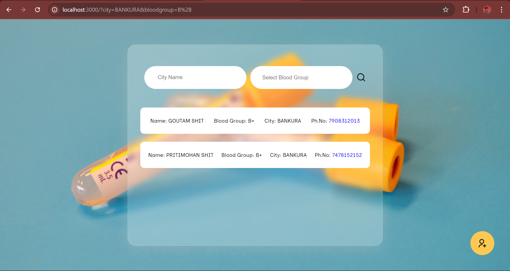

# BloodConnect

## Overview

The BloodConnect is a web application that connects blood donors with individuals in need of blood. Donors can register by providing their details such as blood group and city. Individuals searching for blood can find donors by filtering based on the required blood group and city.

## Features

- **Donor Registration:** Donors can register by providing their blood group, city, and other necessary details.
- **Blood Search:** Individuals can search for blood donors based on blood group and city.
- **Flash Messages:** The app uses flash messages to notify users of successful registrations or errors.
- **Session Management:** User sessions are handled securely using Express Session.

## Technologies Used

- **Frontend:**
  - EJS, CSS
- **Backend:**
  - Node.js, Express.js
- **Database:**
  - MySQL
- **Other:**
  - Connect Flash for notifications
  - Dotenv for environment variables
  - Express Session for session management

## Installation & Setup

### Prerequisites

- Node.js and npm installed on your machine.
- MySQL installed on your machine.

### Steps

1. **Clone the repository:**

   ```bash
   git clone https://github.com/Pritimohan/BloodConnect.git
   cd BloodConnect
   ```

2. **Install dependencies:**

   ```bash
    npm install
   ```

3. **Set up the database:**
   - Create a new MySQL database and run the queries in `database.sql` to set up the required tables.
   - Create a `.env` file in the root directory and add the following environment variables:

     ```
     DB_HOST=localhost
     DB_USER=root
     DB_NAME=donor_finder
     DB_PASSWORD=your_password
     SESSION_SECRET=your_secret
     ```

4. **Run the server:**

   ```bash
   npm start
   ```

5. **Access the application:**

   ```bash
   http://localhost:3000
   ```

## Screenshots

### Home Page



### Donor Registration


### Blood Search


## License

This project is open source and available under the [MIT License](LICENSE).

## Acknowledgements

I would like to express my sincere gratitude to the following:

- **Open-Source Libraries & Tools:** Special thanks to the developers behind Node.js, Express.js, EJS, Connect Flash, MySQL, and the various NPM packages that made this project possible.
- **Community & Resources:** To the amazing online community and platforms like Stack Overflow, GitHub, and free learning resources that guided me through challenges.
- **Inspiration:** To all the blood donors and volunteers worldwide who inspire this project by selflessly contributing to saving lives.
- **Support:** Friends, family, and mentors who provided constant support and encouragement throughout the development process.
- **Feedback:** To anyone who provided feedback, suggestions, or reported issues - your input is invaluable and helps me improve the project.

---

Made with ❤️ by Pritimohan Shit
